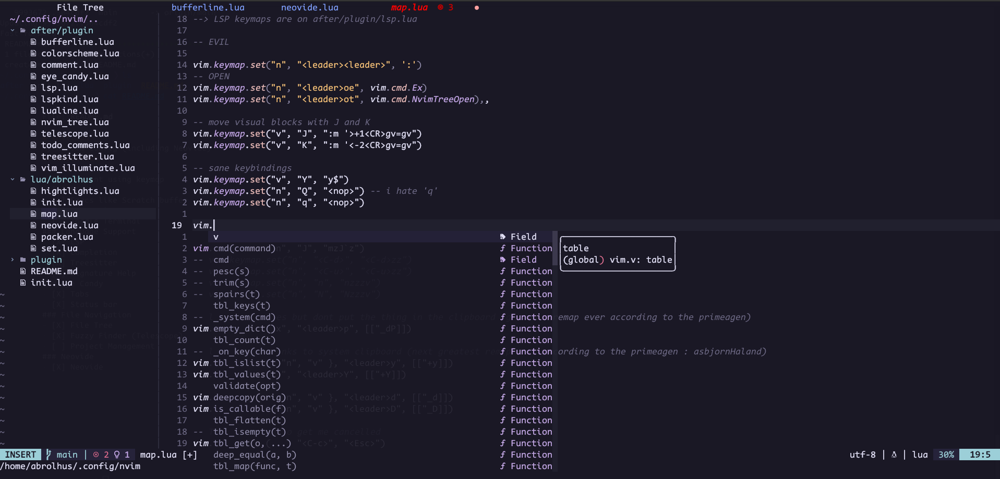

# init.lua
My neovim config (including Neovide)

## Checklist
### Edit
- [X] Comment using keymap
- [ ] REPL
- [ ] Emacs like Scratch buffer
- [ ] Auto pairs 
- [ ] Toggle Terminal
### Language Support
- [X] LSP
- [X] Completion
- [X] Treesitter
- [X] Signature Help
### Eye Candy
- [X] Tabs
- [X] Status bar
### File Navigation
- [X] File Tree
- [X] Fuzzy Finder (Telescope)
- [ ] Project Management
### Neovide
- [X] Neovide

